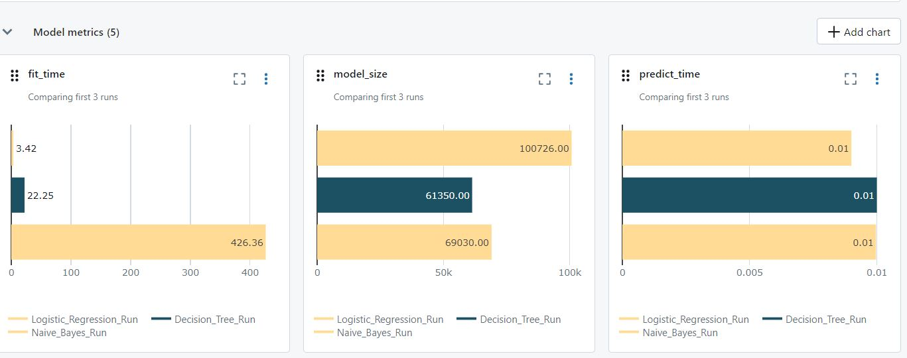
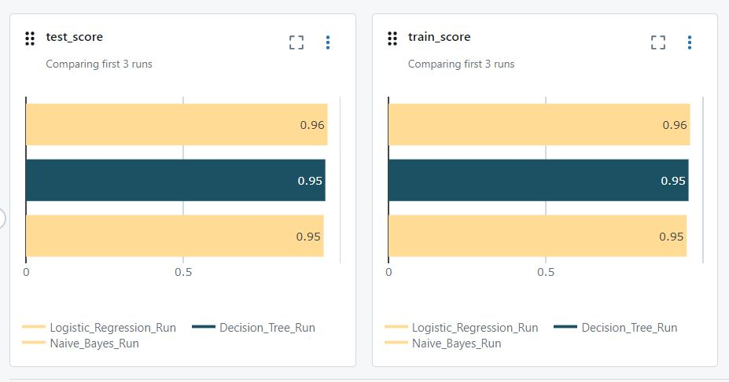
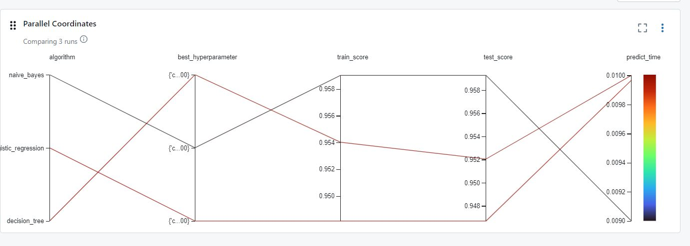
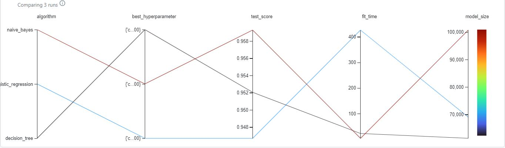

## Sentiment Analysis Project with MLflow

This project demonstrates the integration of MLflow into a Sentiment Analysis machine learning project. MLflow is used for experiment tracking, model management, and reproducibility.

### Objective

The objective of this task is to introduce you to MLflow for experiment tracking, model management, and reproducibility in machine learning projects for Sentiment Analysis.

### Tasks

- Integrate MLflow into your existing machine learning projects.
- Train machine learning models while logging relevant information with MLflow.
- Demonstrate how to log parameters, metrics, and artifacts using MLflow tracking APIs.
- Customize MLflow UI with run names.
- Demonstrate metric plots.
- Demonstrate hyperparameter plots.
- Register models and manage them by tagging them.

### Output

